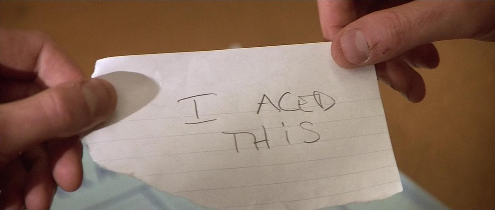

# Real Genius - The Final Exam: LLM Edition

Remember the ridiculously hard final exam Professor Hathaway assigned in the movie *Real Genius* (1985)? The one Mitch and Chris had to ace while simultaneously saving Lazlo Hollyfeld and sabotaging the laser project?

Well, I decided to see what a modern Large Language Model (LLM) would make of those questions. This project presents the actual exam questions (as best as they can be transcribed from the chalkboard scene) and the answers generated by an LLM when prompted with them.

It's a fun exploration of movie lore meets current AI capabilities!

## The Exam Scene

Here's the moment from the movie where the daunting exam is revealed:


*(Image: Screencap from Real Genius (1985))*

---

## The Questions and LLM Answers

Here are the questions from the final exam, followed by the LLM-generated responses. Click on each question to expand the answer.

### Question 1

> 1) From your homework, what energy transfer and plasma chemistry processes do you think are important for the XeCl laser? Discuss. [cite: 1]

<details>
<summary>View LLM Answer for Question 1</summary>

***

**LLM Generated Answer:**

In a XeCl excimer laser, energy transfer and plasma chemistry processes are critical for generating the excited dimer (XeCl*) that produces ultraviolet (UV) laser emission. Below are the key processes:

---

### **1. Energy Transfer Processes**
#### **a. Electron Impact Excitation and Ionization**
- **Electron impact ionization**: High-energy electrons in the plasma ionize xenon (Xe) atoms:

$$
e^- + \text{Xe} \rightarrow \text{Xe}^+ + 2e^-
$$

- **Cl₂ dissociation**: Electrons dissociate chlorine molecules (Cl₂) into Cl atoms:

$$
e^- + \text{Cl}_2 \rightarrow 2\text{Cl} + e^-
$$

- **Electron attachment to Cl**: Free electrons attach to chlorine atoms, forming negative ions:

$$
e^- + \text{Cl} \rightarrow \text{Cl}^-
$$

#### **b. Ion Recombination and Excimer Formation**
- **Ion-ion recombination**: Positive xenon ions ($\text{Xe}^+$) recombine with chloride ions ($\text{Cl}^-$) in the presence of a **buffer gas (e.g., Ne or He)** to form the excited XeCl* excimer:

$$
\text{Xe}^+ + \text{Cl}^- + \text{Ne} \rightarrow \text{XeCl}^* + \text{Ne}
$$

  The buffer gas stabilizes the reaction by carrying away excess energy (three-body collision).
#### **c. Radiative Decay**
- **Lasing transition**: XeCl* emits UV photons (~308 nm) when decaying to a weakly bound or repulsive ground state:

$$
\text{XeCl}^* \rightarrow \text{Xe} + \text{Cl} + h\nu \, (\text{308 nm})
$$

- **Dissociation of ground state**: The ground-state XeCl molecule rapidly dissociates, ensuring population inversion.
---

### **2. Plasma Chemistry Processes**
#### **a. Plasma Formation**
- A high-voltage discharge ionizes the gas mixture (Xe, Cl₂, buffer gas), creating a plasma of electrons, ions, and radicals.
- **Electron thermalization**: Electrons are heated by the electric field, driving ionization and dissociation.

#### **b. Competing Reactions**
- **Xenon dimer formation**: Undesired reactions like $\text{Xe}^+ + \text{Xe} + \text{Ne} \rightarrow \text{Xe}_2^+ + \text{Ne}$ can reduce laser efficiency.
- **Cl⁻ loss**: Chloride ions may recombine with other ions (e.g., $\text{Cl}^- + \text{Xe}_2^+ \rightarrow \text{Xe} + \text{XeCl}$).

#### **c. Buffer Gas Role**
- **Thermalization**: The buffer gas (e.g., Ne) moderates electron energy and facilitates three-body collisions.
- **Quenching**: Prevents energy loss by quenching metastable states or impurities.

---

### **3. Key Factors Affecting Laser Performance**
1.  **Gas mixture ratios**: Optimal Xe:Cl₂:buffer gas ratios maximize XeCl* formation.
2.  **Pressure and temperature**: Higher pressure enhances three-body collisions but increases collisional quenching.
3.  **Electric field parameters**: Pulse duration and voltage affect electron energy distribution and plasma density.
4.  **Impurities**: Trace gases (e.g., O₂, H₂O) can quench XeCl* or form competing species.
---

### **Summary**
The XeCl laser relies on:
- **Electron-driven ionization and dissociation** to create $\text{Xe}^+$ and $\text{Cl}^-$.
- **Three-body recombination** to form XeCl* with buffer gas assistance.
- **Efficient radiative decay** of XeCl* to maintain population inversion.
- **Suppression of competing reactions** (e.g., dimer formation) via gas mixture and discharge optimization.
These processes enable the XeCl laser to achieve high-power UV output, widely used in industrial and medical applications.

***
</details>

---

### Question 2

> 2) Derive an expression for the collision-broadened linewidth in a gas laser, such as CO_2. [cite: 2]

<details>
<summary>View LLM Answer for Question 2</summary>

***

**LLM Generated Answer:**

To derive the collision-broadened linewidth in a gas laser, such as a CO2 laser, we consider the following steps:

1. **Collision Frequency**: The collision frequency $ \gamma $ (number of collisions per second per molecule) is given by:

$$
\gamma = n \sigma v_{\text{rel}}
$$

   where $ n $ is the number density, $ \sigma $ is the collision cross-section, and $ v_{\text{rel}} $ is the average relative velocity between molecules.

2. **Relative Velocity**: The average relative velocity $ v_{\text{rel}} $ for molecules with reduced mass $ \mu $ is:

$$
v_{\text{rel}} = \sqrt{\frac{8 k_B T}{\pi \mu}}
$$

   where $ k_B $ is Boltzmann's constant, $ T $ is the temperature, and $ \mu $ is the reduced mass of the colliding particles.

3. **Number Density**: Using the ideal gas law $ P = n k_B T $, the number density $ n $ can be expressed as:

$$
n = \frac{P}{k_B T}
$$

  

4. **Collision Frequency Expression**: Substituting $ n $ and $ v_{\text{rel}} $ into the collision frequency formula:

$$
\gamma = \frac{P}{k_B T} \sigma \sqrt{\frac{8 k_B T}{\pi \mu}}
$$

  

5. **Simplifying Collision Frequency**: Simplifying the expression for $ \gamma $:

$$
\gamma = \frac{P \sigma}{\sqrt{\pi \mu k_B T}} \sqrt{\frac{8}{\pi}}
$$

  

6. **Linewidth Calculation**: The collision-broadened linewidth $ \Delta \nu_c $ is related to the collision frequency by a factor of $ \frac{1}{\pi} $:

$$
\Delta \nu_c = \frac{\gamma}{\pi}
$$

  

7. **Final Expression**: Substituting the simplified collision frequency into the linewidth formula:

$$
\Delta \nu_c = \frac{2 \sqrt{2} \sigma P}{\pi^{3/2} \sqrt{\mu k_B T}}
$$

  

Thus, the collision-broadened linewidth in a gas laser is given by:

$$
\boxed{\Delta \nu = \frac{2\sqrt{2} \sigma P}{\pi^{3/2} \sqrt{\mu k_B T}}}
$$

  

***
</details>

---

### Question 3

> 3) Using an appropriate set of rate equations, describe a self-terminating laser. Give an example and estimate lifetimes, etc. [cite: 3]

<details>
<summary>View LLM Answer for Question 3</summary>

***

**LLM Generated Answer:**

To describe a **self-terminating laser** (e.g., a copper vapor laser), we use rate equations that account for population dynamics between energy levels and photon density. These lasers rely on a transient population inversion where the upper laser level ($N_1$) has a **shorter lifetime** ($\tau_1$) than the lower level ($N_2$, $\tau_2$), causing lasing to "self-terminate" once $N_1$ depletes. Below is the framework:

---

### **Rate Equations for a Self-Terminating Laser**
1. **Population Dynamics**:

$$
\frac{dN_1}{dt} = W_p N_0 - \frac{N_1}{\tau_1} - B \phi (N_1 - N_2)
$$

$$
\frac{dN_2}{dt} = B \phi (N_1 - N_2) - \frac{N_2}{\tau_2}
$$

$$
\frac{d\phi}{dt} = B \phi (N_1 - N_2) - \frac{\phi}{\tau_c} + \beta \frac{N_1}{\tau_1}
$$

   - $N_0, N_1, N_2$: Populations of ground, upper, and lower states.
   - $W_p$: Pumping rate (e.g., electron collisions in a discharge).
   - $B$: Stimulated emission coefficient.
   - $\phi$: Photon density.
   - $\tau_c$: Cavity photon lifetime ($1/\tau_c = \text{losses}$).
   - $\beta$: Fraction of spontaneous emission into the lasing mode.

2. **Key Conditions**:
   - $\tau_1 \ll \tau_2$: Upper state decays faster than the lower state.
   - Population inversion ($N_1 > N_2$) occurs transiently during pumping.
---

### **Example: Copper Vapor Laser (CVL)**
- **Laser Transition**: $ \lambda = 510.6 \, \text{nm} $ (green) and $578.2 \, \text{nm}$ (yellow).
- **Lifetimes**:
  - Upper state ($N_1$): $\tau_1 \approx 10 \, \text{ns} - 50 \, \text{ns}$.
  - Lower state ($N_2$): $\tau_2 \approx 1 \, \mu\text{s} - 10 \, \mu\text{s}$.
- **Mechanism**:
  1. **Pumping**: High-voltage discharge excites Cu atoms to $N_1$.
  2. **Lasing**: Stimulated emission depletes $N_1$, but $N_2$ persists.
  3. **Self-Termination**: $N_2 > N_1$ after $N_1$ decays, halting lasing until $N_2$ empties.
---

### **Pulse Characteristics**
- **Pulse Duration**: Governed by $\tau_1$. For $\tau_1 \approx 20 \, \text{ns}$, pulses last $10-50 \, \text{ns}$.
- **Repetition Rate**: Limited by $\tau_2$. For $\tau_2 \approx 5 \, \mu\text{s}$, rates reach $1-10 \, \text{kHz}$.
- **Efficiency**: Enhanced by fast pumping ($W_p$) and low collisional quenching of $N_2$.
---

### **Other Examples**
1. **Gold Vapor Laser**: $ \lambda = 627.8 \, \text{nm} $, similar dynamics.
2. **Helium-Cadmium Laser**: Partially self-terminating in some transitions.

---

### **Key Implications**
- **Pulsed Operation**: Inherent due to transient inversion.
- **High Peak Power**: Short pulses enable intense bursts.
- **Gas Mixture Optimization**: Buffer gases (e.g., Ne) reduce $\tau_2$ via collisions, enabling higher repetition rates.
---

This framework explains why self-terminating lasers are pulsed and require precise timing between excitation and relaxation processes. The copper vapor laser exemplifies these principles with its characteristic short, high-power green/yellow pulses.

***
</details>

---

### Question 4

> 4) Design an optical system for a high gain laser such as a HF. Include a stable resonator, spatial filter and an amplifier. [cite: 4]

<details>
<summary>View LLM Answer for Question 4</summary>

***

**LLM Generated Answer:**

**Optical System Design for a High-Gain HF Laser**

**1. Stable Resonator Configuration:**
   - **Mirrors:** - **High Reflector (HR):** Concave mirror with radius $ R_1 = 2L $ (confocal design), optimized for 2.7–3.0 µm IR wavelengths. Coated with protected gold for high reflectivity ($>99.9\%$).
     - **Output Coupler (OC):** Concave mirror with $ R_2 = 2L $, reflectivity ~50% to balance feedback and output extraction.
   - **Cavity Length ($ L $):** Chosen to satisfy the stability condition $ 0 \leq (1 - L/R_1)(1 - L/R_2) \leq 1 $. For a confocal design, $ L = R/2 $, ensuring stability and Gaussian mode confinement.
   - **Gain Medium:** HF gas (H₂ + F₂ mixture), transversely pumped by electric discharge for population inversion.

**2. Spatial Filter Assembly:**
   - **Lens Pair:** Placed after the OC. Use plano-convex ZnSe lenses (anti-reflective coated for 3 µm) with focal length $ f $.
   - **Pinhole:** Diamond-coated tungsten pinhole at the focal point. Diameter $ d = \frac{2.44 \lambda f}{D} $, where $ D $ is the input beam diameter. For $ \lambda = 3 \, \mu\text{m} $, $ f = 500 \, \text{mm} $, and $ D = 10 \, \text{mm} $, $ d \approx 37 \, \mu\text{m} $.
   - **Function:** Filters out higher-order modes (e.g., TEM₀₁, TEM₁₀) to preserve beam quality ($ M^2 < 1.1 $).

**3. Amplifier Stage (MOPA Configuration):**
   - **Gain Module:** Double-pass amplifier with flowing HF gas (pressure ~50 Torr) to sustain population inversion. Mirrors at both ends (HR at rear, dichroic OC at front) for beam recirculation.
   - **Beam Expansion:** Telescope before the amplifier to match the beam to the amplifier aperture (e.g., 20 mm diameter), reducing peak intensity to <1 GW/cm² to avoid optical damage.
   - **Spatial Filter Between Passes:** Secondary pinhole to suppress amplified spontaneous emission (ASE) and maintain beam quality.

**4. Beam Transport and Isolation:**
   - **Steering Mirrors:** Gold-coated molybdenum substrates, water-cooled, with kinematic mounts for alignment stability.
   - **Faraday Isolators:** Positioned between the oscillator and amplifier to prevent back-reflections. Use terbium gallium garnet (TGG) crystals with anti-reflective coatings.
   - **Diagnostics:** Pyroelectric cameras for beam profiling, thermopile power meters, and spectrometers for wavelength monitoring.

**5. Thermal and Mechanical Design:**
   - **Cooling System:** Active water cooling for mirrors and amplifier electrodes. Gas flow rate optimized to remove heat while minimizing turbulence ($ \Delta T < 1^\circ \text{C} $).
   - **Vibration Isolation:** Optical tables with pneumatic isolators to reduce mechanical noise (sub-µm stability).
   - **Gas Handling:** Recirculating gas system with scrubbers to remove reaction byproducts (e.g., HF → H₂ + F₂ regeneration).

**Example Parameters for a 100 W HF Laser:**
- **Oscillator Output:** 10 W, TEM₀₀ mode, 3 µm wavelength.
- **Amplifier Gain:** 10 dB (10× amplification), achieving 100 W output.
- **Pulse Characteristics:** Repetition rate 1 kHz, pulse width 10 ns (peak power ~10 MW).
- **Lifetimes:**
  - **Upper Laser Level ($ \tau_{\text{upper}} $):** ~1 µs (dictates pumping cycle).
  - **Lower Laser Level ($ \tau_{\text{lower}} $):** ~10 ns (ensures self-terminating behavior).

**Challenges and Mitigations:**
- **Parasitic Oscillations:** Use absorbing coatings on amplifier walls and inter-stage spatial filters.
- **Thermal Lens Effects:** Active cooling and gas flow uniformity to minimize refractive index gradients.
- **Beam Misalignment:** Automated alignment systems with piezoelectric actuators for real-time correction.

**Summary Diagram:**

```
[Stable Resonator] → [Spatial Filter] → [Faraday Isolator] → [Amplifier] → [Output Beam]
      (HF Gas)           (ZnSe Lenses)      (TGG Crystal)     (Double-Pass)
```

This design balances high gain with beam quality, enabling scalable power output for applications like material processing or directed energy systems.

***
</details>

---

### Question 5

> 5) Describe the electron energy distribution function in a continuous, 20-100 torr discharge driven CO_2 laser, assume an appropriate N_2, He, CO_2 mixture. [cite: 5]

<details>
<summary>View LLM Answer for Question 5</summary>

***

**LLM Generated Answer:**

In a continuous-wave CO₂ laser operating at 20–100 Torr with a gas mixture of N₂, He, and CO₂, the **electron energy distribution function (EEDF)** is shaped by the interplay of the electric field, gas composition, and collisional processes. Below is a structured description:

---

### **Key Characteristics of the EEDF**
1. **Non-Maxwellian Distribution**:
   - The EEDF deviates from a Maxwellian distribution due to inelastic collisions (vibrational/rotational excitation, ionization) and the presence of a direct-current (DC) or radio-frequency (RF) electric field.
   - **High-energy tail**: Sustained by the electric field, enabling electrons to reach energies sufficient for vibrational excitation of N₂ (~2–3 eV) and CO₂ (~0.1–1 eV for bending/stretching modes).

2. **Two-Term Approximation**:
   - At moderate pressures (20–100 Torr), the EEDF can often be described by the **two-term Boltzmann equation**, where the distribution is split into an isotropic term and a small anisotropic correction.
   - The EEDF depends on the reduced electric field ($E/N$, where $E$ is the electric field and $N$ is the gas number density).

3. **Impact of Gas Mixture**:
   - **Helium (He)**: Dominates elastic collisions due to its low mass, cooling electrons and reducing the average electron energy. This broadens the low-energy peak of the EEDF.
   - **Nitrogen (N₂)**: High inelastic collision cross-sections for vibrational excitation (~2–3 eV) create "dips" in the EEDF at these energies as electrons lose energy to N₂.
   - **CO₂**: Contributes to inelastic losses at lower energies (0.1–1 eV) via asymmetric stretching/bending mode excitation.
---

### **EEDF Structure in CO₂ Laser Discharges**
1. **Low-Energy Peak**:
   - Electrons with energies <1 eV dominate due to frequent elastic collisions with He.
   - Governed by **elastic energy losses**: Electron energy loss per collision with He is small ($ \Delta \epsilon \sim 2m_e/M_{\text{He}} \cdot \epsilon $), preserving the high-energy tail.

2. **Mid-Energy Range (1–3 eV)**:
   - Depletion due to vibrational excitation of CO₂ and N₂.
   - **CO₂ vibrational modes**: Asymmetric stretching (0.29 eV), symmetric stretching (0.17 eV), and bending (0.08 eV) absorb electron energy.
   - **N₂ vibrational excitation**: Requires ~2–3 eV, creating a noticeable drop in the EEDF.

3. **High-Energy Tail (>3 eV)**:
   - Sustained by the electric field, enabling ionization ($ \sim 15 \, \text{eV} $ for CO₂) and electronic excitation of N₂/CO₂.
   - Critical for maintaining plasma density and pumping N₂ vibrational states (energy transfer to CO₂).
---

### **Pressure Dependence (20–100 Torr)**
- **At 20 Torr**:
  - Longer electron mean free path → higher electron temperatures ($T_e \sim 1–2 \, \text{eV}$).
  - Sharper high-energy tail due to fewer collisions.
- **At 100 Torr**:
  - Shorter mean free path → lower $T_e \sim 0.5–1 \, \text{eV}$.
  - Broader low-energy peak and reduced high-energy tail due to frequent collisions.
---

### **Rate Coefficients and Critical Energies**
- **Vibrational excitation rate (N₂)**: Peaks at ~2–3 eV.
- **Ionization rate (CO₂)**: Threshold ~15 eV, but effective ionization occurs at lower energies due to stepwise processes.
- **Electron-impact dissociation**: CO₂ → CO + O occurs at >7 eV, influencing gas chemistry and EEDF.
---

### **Numerical Example**
For a typical CO₂ laser mixture (10% CO₂, 10% N₂, 80% He) at 50 Torr:
- **Average electron energy**: ~1–1.5 eV.
- **Electron density ($n_e$)**: $10^{10}–10^{11} \, \text{cm}^{-3}$.
- **Dominant energy loss channels**:
  - 60% elastic collisions (He),
  - 30% vibrational excitation (N₂/CO₂),
  - 10% ionization/electronic excitation.
---

### **Implications for Laser Performance**
- **Population inversion**: Relies on selective pumping of N₂ vibrational states by electrons in the 2–3 eV range.
- **Discharge stability**: High He content stabilizes the EEDF by cooling electrons, preventing arcing.
- **Gas heating**: Electron energy transfer to translational modes (via CO₂/He) raises gas temperature, requiring active cooling.
---

### **Summary**
The EEDF in a 20–100 Torr CO₂ laser discharge is a **non-thermal, structured distribution** with:
- A **low-energy peak** moderated by He elastic collisions,
- **Mid-energy dips** from CO₂/N₂ vibrational excitation,
- A **high-energy tail** sustained by the electric field for ionization and N₂ pumping.
This balance ensures efficient energy transfer to N₂ and CO₂ vibrational modes while maintaining discharge stability—a key requirement for continuous-wave lasing at 10.6 µm.

***
</details>

---

### Question 6a

> 6 a) Choose a diatomic electronic transition with high fluorescent yield. Sketch the potential surfaces. [cite: 6]

<details>
<summary>View LLM Answer for Question 6a</summary>

***

**LLM Generated Answer:**

**Diatomic Molecule Choice:**
Iodine (I₂) exhibits a high fluorescent yield in its **$B³Π₀⁺ᵤ → X¹Σ₍g⁺⁾$** electronic transition, emitting visible light (~500–700 nm). This transition is widely used in laser-induced fluorescence and spectroscopy due to its efficiency.
---

### **Potential Energy Curves (PECs) for I₂ $B³Π₀⁺ᵤ → X¹Σ₍g⁺⁾$ Transition**

1. **Ground State ($X¹Σ₍g⁺⁾$):**
   - **Equilibrium Bond Length ($rₑ$):** ~2.67 Å.
   - **Potential Well:** Deep and narrow, typical of a covalent bond.
   - **Vibrational Levels:** Closely spaced, low-energy vibrations.

2. **Excited State ($B³Π₀⁺ᵤ$):**
   - **Equilibrium Bond Length ($rₑ$):** ~3.0 Å (longer than X state).
   - **Potential Well:** Shallower and broader, with a higher energy minimum.
   - **Vibrational Levels:** More widely spaced than in the X state.
---

### **Franck-Condon Principle and Fluorescence**
- **Absorption:** Vertical transitions (blue arrow) from the ground vibrational level of X to higher vibrational levels of B (due to bond-length mismatch).
- **Emission:** Relaxation from B to X (red arrows) produces a vibrational progression in fluorescence. Strong overlap between B and X vibrational wavefunctions ensures high radiative efficiency.


*Simplified sketch of I₂ PECs. Blue: $X¹Σ₍g⁺⁾$. Red: $B³Π₀⁺ᵤ$. Arrows show absorption (up) and fluorescence (down).*

---

### **Key Features Enabling High Fluorescent Yield**
1. **Spin-Orbit Coupling:** Heavy iodine atoms enable partial allowance of the spin-forbidden triplet→singlet transition.
2. **Bound Excited State:** The $B³Π₀⁺ᵤ$ state is bound, avoiding predissociation.
3. **Long Radiative Lifetime:** ~1 μs, allowing fluorescence to dominate over non-radiative decay.
4. **Minimal Quenching:** At low pressures, collisional deactivation is reduced.
---

### **Example Emission Spectrum**
- **Peak Wavelengths:** ~532 nm (strongest line), 580 nm, 630 nm.
- **Vibrational Progression:** Resolved peaks due to transitions between B (v') and X (v'') vibrational levels.
---

### **Comparison to Other Diatomics**
- **O₂ (Schumann-Runge):** Ultraviolet transitions with low yield due to predissociation.
- **Na₂ ($A¹Σ₍u⁺⁾ → X¹Σ₍g⁺⁾$):** Visible emission but lower yield than I₂.
---

This combination of favorable potential curve alignment and electronic structure makes I₂ a benchmark for high-yield diatomic fluorescence.

***
</details>

---

### Question 6b

> 6 b) Write a rate equation model describing the oxygen-pumped iodine system. [cite: 7]

<details>
<summary>View LLM Answer for Question 6b</summary>

***

**LLM Generated Answer:**

**Rate Equation Model for Oxygen-Pumped Iodine Laser (COIL System)**

---

### **Key Species and Variables**
1. **O₂(¹Δ)**: Singlet delta oxygen (pump source), density $ N_{O_2^s} $
2. **O₂(³Σ)**: Ground-state oxygen, density $ N_{O_2^g} $
3. **I₂**: Molecular iodine, density $ N_{I_2} $
4. **I(²P_{3/2})**: Ground-state iodine atoms, density $ N_{I_g} $
5. **I(²P_{1/2})**: Excited iodine atoms, density $ N_{I_e} $
6. **φ**: Photon density in the cavity

---

### **Rate Equations**

1. **O₂(¹Δ) Population**:

$$
\frac{dN_{O_2^s}}{dt} = -k_{\text{diss}} N_{O_2^s} N_{I_2} - k_{\text{pump}} N_{O_2^s} N_{I_g} - A_{O_2} N_{O_2^s}
$$

   - Dissociation of I₂ ($k_{\text{diss}}$)
   - Energy transfer to I ($k_{\text{pump}}$)
   - Spontaneous decay of O₂(¹Δ) ($A_{O_2}$).

2. **O₂(³Σ) Population**:

$$
\frac{dN_{O_2^g}}{dt} = k_{\text{diss}} N_{O_2^s} N_{I_2} + k_{\text{pump}} N_{O_2^s} N_{I_g} + A_{O_2} N_{O_2^s}
$$

   - Gains from dissociation, pumping, and O₂(¹Δ) decay.

3. **I₂ Population**:

$$
\frac{dN_{I_2}}{dt} = -k_{\text{diss}} N_{O_2^s} N_{I_2}
$$

   - Loss due to dissociation by O₂(¹Δ).

4. **Ground-State Iodine (I_g)**:

$$
\frac{dN_{I_g}}{dt} = 2 k_{\text{diss}} N_{O_2^s} N_{I_2} - k_{\text{pump}} N_{O_2^s} N_{I_g} + \sigma_{\text{stim}} c \phi (N_{I_e} - N_{I_g}) + A_{21} N_{I_e} + k_{\text{quench}} N_M N_{I_e}
$$

   - Production from I₂ dissociation ($2 k_{\text{diss}}$).
   - Loss to pumping ($k_{\text{pump}}$).
   - Gain from stimulated/spontaneous emission and quenching.

5. **Excited-State Iodine (I_e)**:

$$
\frac{dN_{I_e}}{dt} = k_{\text{pump}} N_{O_2^s} N_{I_g} - \sigma_{\text{stim}} c \phi (N_{I_e} - N_{I_g}) - A_{21} N_{I_e} - k_{\text{quench}} N_M N_{I_e}
$$

   - Pumping from O₂(¹Δ).
   - Losses from stimulated emission, spontaneous decay ($A_{21}$), and collisional quenching ($k_{\text{quench}}$).

6. **Photon Density**:

$$
\frac{d\phi}{dt} = \sigma_{\text{stim}} c \phi (N_{I_e} - N_{I_g}) + \beta A_{21} N_{I_e} - \frac{\phi}{\tau_c}
$$

   - Gain from stimulated emission and spontaneous coupling ($\beta$).
   - Loss from cavity lifetime ($\tau_c$).

---

### **Parameters**
| Symbol                    | Description                                  | Typical Value               |
|---------------------------|----------------------------------------------|-----------------------------|
| $k_{\text{diss}}$         | I₂ dissociation rate constant                | $1 \times 10^{-16}$ cm³/s   |
| $k_{\text{pump}}$         | O₂(¹Δ)→I energy transfer rate                | $3 \times 10^{-16}$ cm³/s   |
| $A_{O_2}$                 | O₂(¹Δ) spontaneous decay rate                | $2 \times 10^{-4}$ s⁻¹      |
| $A_{21}$                  | I(²P₁/₂) spontaneous emission rate           | $1.3 \times 10^{-3}$ s⁻¹    |
| $\sigma_{\text{stim}}$    | Stimulated emission cross-section            | $1.3 \times 10^{-16}$ cm²   |
| $k_{\text{quench}}$        | Quenching rate (e.g., by O₂/He)            | $5 \times 10^{-15}$ cm³/s   |
| $N_M$                     | Buffer gas density (e.g., He)                | $10^{17}$ cm⁻³              |
| $\beta$                   | Spontaneous emission coupling factor         | $10^{-5}$–$10^{-6}$         |
| $\tau_c$                  | Cavity photon lifetime                       | $1$–$10$ ns                 |

---

### **Lasing Dynamics**
- **Threshold Condition**: Population inversion $N_{I_e} > N_{I_g}$ and sufficient photon gain to overcome cavity losses.
- **Steady-State Output**: Solved by setting $d\phi/dt = 0$, yielding:

$$
\phi = \frac{\beta A_{21} N_{I_e}}{\frac{1}{\tau_c} - \sigma_{\text{stim}} c (N_{I_e} - N_{I_g})}
$$

---

### **Example Simulation**
**Initial Conditions** (Typical COIL):
- $N_{O_2^s}(0) = 10^{16}$ cm⁻³
- $N_{I_2}(0) = 10^{15}$ cm⁻³
- $N_{I_g}(0) = 0$
- $N_{I_e}(0) = 0$
- $\phi(0) = 0$

**Outcome**:
- Dissociation of I₂ rapidly produces $N_{I_g}$.
- O₂(¹Δ) pumps $N_{I_e}$ until inversion is achieved.
- Photon density $\phi$ grows exponentially, then saturates as $N_{I_e}$ depletes.
---

### **Summary**
This model captures the interplay between oxygen pumping, iodine dissociation, and laser dynamics. It highlights the roles of energy transfer, cavity design, and quenching in achieving high-power output from a COIL system.

***
</details>

---

## Conclusion

So, how did the LLM do? Pretty well, arguably! It generated plausible, detailed, and technically relevant answers to some very specific laser physics questions. Whether they would have satisfied Professor Hathaway... well, that's another story.


*(Image: Inspired by Real Genius)*